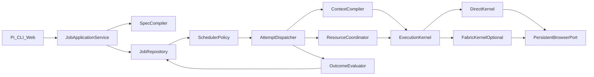

# Jobs V2 — Normative Specification

Status: **normative**. Implementation must satisfy every SHALL below.
Product overview: [`docs/long-running-jobs.md`](long-running-jobs.md).
Evaluation protocol: [`docs/jobs-v2-evaluation.md`](jobs-v2-evaluation.md).
Work index: [`work-items/epics/v2-campaigns.md`](../work-items/epics/v2-campaigns.md).

This document is the single source of architectural truth for durable jobs and campaigns.
A cheaper model implementing a ticket MUST NOT invent architecture; it implements cited
requirement IDs only. If a requirement is ambiguous, stop and escalate rather than guess.

## How to read a requirement

Every normative statement has the form:

```text
REQ-ID. SHALL wording.
- Rationale: why
- Owner: module path under src/durable/
- Invariant: what must always hold
- Evidence: L0–L7 (see jobs-v2-evaluation.md)
- Ticket: CAMPAIGN-XX-TYY
```

RFC 2119: SHALL / MUST / MUST NOT are mandatory. SHOULD / MAY are discretionary only when
the ticket explicitly allows a choice.

---

## 0. Settled decisions (do not re-decide)

1. Job is the explicit durable root. Campaign is a recurring multi-case job mode.
2. One-shot goals are not jobs.
3. SpecVersion, Case, WorkItem, Attempt, Effect, HumanRequest, ResourceState each have
   one authority. Run is telemetry. Sprint is never authoritative.
4. Code lives under `src/durable/` with layers `domain`, `application`, `ports`,
   `infrastructure/sqlite`, `adapters`. Domain imports no Pi, Playwright, CLI, SQLite, or
   Fabric.
5. One versioned root SQLite control database. Large evidence stays in content-addressed
   files. Node 24 is a prerequisite. If `node:sqlite` fails its canary, stop for an
   explicit decision; do not silently swap storage.
6. Specs compile strictly to immutable canonical bytes. No string→predicate coercion and no
   wildcard grant synthesis at approval.
7. Every WorkItem is pinned to a SpecVersion hash. Revision requires an explicit
   retain/map/cancel/archive migration plan.
8. SchedulerPolicy is pure. AttemptDispatcher requires ExecutionHost. Missing runtime is
   `runtime_unavailable`, never `idle`.
9. Leases renew and fence. Stale attempts MUST NOT commit.
10. Direct and Fabric share one ExecutionKernel contract. Direct ships first; Fabric is
    optional and cannot fork safety or state.
11. Challenges, approvals, retries, and cancellation use one typed OperationOutcome.
    Human-only work MUST NOT wake by timer alone.
12. Effects use prepared → dispatched → observed | uncertain → reconciled | abandoned.
    A local claim is not proof a remote effect happened.
13. Top-level completion uses durable typed outputs, provenance, artifacts, and aggregate
    oracles — not the executor claim or current page.
14. No dual-write migration. Prototype jobs are validated and imported read-only or
    archived; malformed records are never scheduled.



---

## 1. Domain model (DOM-*)

### Vocabulary

| Term | Authority | Not |
| --- | --- | --- |
| Job | Durable root: lifecycle, active SpecVersion, aggregate outcome | Browser session, transcript |
| Campaign | Product view of a multi-case recurring Job | Separate engine |
| SpecVersion | Immutable compiled workflow + policy bytes + hash | Draft chat notes |
| Case | Independent subject with stable key, facts, stage, outcome | WorkItem graph |
| WorkItem | Schedulable operation from an approved template | Model conversation |
| Attempt | One leased bounded execution of one WorkItem or read-only batch | Job completion |
| Effect | External consequence journal | Generic click result |
| HumanRequest | Decision / approval / challenge / identity intervention | Proof of browser success |
| ResourceState | Profile / host / account budget and breaker | Case meaning |
| Run | Attempt telemetry (metrics, payloads) | Workflow truth |
| Goal | One-shot chat objective | Job |
| Sprint | Deprecated; derived batch only | Authoritative progress |

### Records (TypeScript shapes)

```typescript
type JobId = string;           // job_*
type SpecHash = string;        // 16+ hex of canonical bytes
type CaseKey = string;         // task-defined stable key
type WorkItemId = string;
type AttemptId = string;
type EffectId = string;
type HumanRequestId = string;
type FenceToken = string;
type EvidenceId = string;

type JobLifecycle =
  | "planning"
  | "awaiting_plan_approval"
  | "active"
  | "paused"
  | "completed"
  | "failed"
  | "cancelled"
  | "archived";

type WorkItemStatus =
  | "pending"
  | "ready"
  | "leased"
  | "blocked"
  | "done"
  | "failed"
  | "cancelled"
  | "abandoned";

type EffectStatus =
  | "prepared"
  | "dispatched"
  | "observed"
  | "uncertain"
  | "reconciled"
  | "abandoned";

type HumanKind = "decision" | "approval" | "challenge" | "identity";
type HumanStatus =
  | "waiting"
  | "ready"
  | "rehydrating"
  | "resolved"
  | "expired"
  | "skipped";

interface Job {
  jobId: JobId;
  title: string;
  objective: string;
  lifecycle: JobLifecycle;
  caseMode: "singleton" | "discovered" | "recurring";
  activeSpecVersion?: number;
  activeSpecHash?: SpecHash;
  draftSpecVersion: number;
  createdAt: string;
  updatedAt: string;
  pausedAt?: string;
  completedAt?: string;
  nextWakeAt?: string;
}

interface SpecVersion {
  jobId: JobId;
  version: number;
  status: "draft" | "proposed" | "approved" | "superseded";
  hash?: SpecHash;
  canonicalBytes: string; // exact approved or proposed bytes
  createdAt: string;
  approvedAt?: string;
}

interface Case {
  jobId: JobId;
  caseKey: CaseKey;
  label: string;
  stage: string;
  facts: Record<string, unknown>;
  outcome?: { status: "success" | "failed" | "dropped"; detail: string };
  createdAt: string;
  updatedAt: string;
}

interface WorkItem {
  id: WorkItemId;
  jobId: JobId;
  caseKey?: CaseKey; // absent for job-scoped seeds
  templateId: string;
  specVersion: number;
  specHash: SpecHash;
  objective: string;
  status: WorkItemStatus;
  dependencies: WorkItemId[];
  resourceKey?: string;
  attempts: number;
  maxAttempts: number;
  deferredUntil?: string;
  checkpoint?: OperationCheckpoint;
  createdAt: string;
  updatedAt: string;
}

interface Attempt {
  id: AttemptId;
  jobId: JobId;
  workItemId: WorkItemId;
  fenceToken: FenceToken;
  status: "running" | "completed" | "failed" | "blocked" | "cancelled";
  leaseExpiresAt: string;
  startedAt: string;
  finishedAt?: string;
  outcome?: OperationOutcome<unknown>;
  costUsd: number;
  turns: number;
  siteActions: number;
}

interface Effect {
  id: EffectId;
  jobId: JobId;
  workItemId: WorkItemId;
  attemptId?: AttemptId;
  kind: string;
  status: EffectStatus;
  identityKey: string;
  destination?: string;
  evidenceIds: EvidenceId[];
  preparedAt: string;
  dispatchedAt?: string;
  observedAt?: string;
  reconciledAt?: string;
}

interface HumanRequest {
  id: HumanRequestId;
  jobId: JobId;
  kind: HumanKind;
  status: HumanStatus;
  perishable: boolean;
  workItemId?: WorkItemId;
  caseKey?: CaseKey;
  resourceKey: string;
  reason: string;
  handoff: string;
  checkpoint?: OperationCheckpoint;
  resolution?: string;
  createdAt: string;
  updatedAt: string;
  expiresAt?: string;
  resolvedAt?: string;
}

interface ResourceState {
  key: string; // profile::host::account
  scope: "work_item" | "host" | "account" | "profile" | "session";
  failures: number;
  notBefore?: string;
  circuitOpenUntil?: string;
  windowActions: number;
  windowCostUsd: number;
  updatedAt: string;
}
```

### Requirements

**DOM-01.** The system SHALL use exactly the vocabulary table above for durable state and
user-facing status.
- Rationale: eliminate goal/run/task/sprint overload
- Owner: `src/durable/domain/types.ts`
- Invariant: no authoritative Sprint record
- Evidence: L0
- Ticket: CAMPAIGN-01-T01

**DOM-02.** Domain modules under `src/durable/domain/` MUST NOT import Pi, Playwright,
CLI, SQLite, Fabric, or Node filesystem APIs.
- Rationale: keep pure reducers portable and testable
- Owner: `src/durable/domain/`
- Invariant: import-boundary test fails on banned imports
- Evidence: L0
- Ticket: CAMPAIGN-01-T01

**DOM-03.** Job lifecycle transitions SHALL obey this matrix and no other:

| From | Allowed to |
| --- | --- |
| planning | awaiting_plan_approval, cancelled |
| awaiting_plan_approval | planning, active, cancelled |
| active | paused, completed, failed, cancelled, planning |
| paused | active, cancelled |
| failed | planning, cancelled, archived |
| completed | archived |
| cancelled | archived |
| archived | (none) |

- Rationale: crashes must never invent durable `running`
- Owner: `src/durable/domain/job-lifecycle.ts`
- Invariant: illegal transitions throw
- Evidence: L0
- Ticket: CAMPAIGN-01-T01

**DOM-04.** WorkItem status transitions SHALL be pure reducer functions of commands; the
model MUST NOT set durable status directly.
- Rationale: prevent transcript-authored workflow state
- Owner: `src/durable/domain/work-item.ts`
- Invariant: every status change cites a command
- Evidence: L0
- Ticket: CAMPAIGN-01-T01

**DOM-05.** Case identity SHALL be `(jobId, caseKey)` unique. Discovery upsert MUST NOT
create a second Case for the same key.
- Rationale: recurring campaigns must be idempotent
- Owner: `src/durable/domain/case.ts`
- Invariant: uniqueness constraint + reducer test
- Evidence: L0 then L1
- Ticket: CAMPAIGN-01-T01, CAMPAIGN-03-T01

**DOM-06.** Derived display status SHALL be computed, never stored: `running` (lease held),
`idle` (active, nothing eligible), `waiting_human` (open HumanRequest), `blocked`
(resource breaker), `runtime_unavailable` (no ExecutionHost).
- Rationale: avoid durable running / false idle
- Owner: `src/durable/application/status.ts`
- Invariant: display never written to Job.lifecycle
- Evidence: L0, L6
- Ticket: CAMPAIGN-01-T01, CAMPAIGN-04-T01

**DOM-07.** `cancelled` SHALL be a first-class command on Job and WorkItem with service,
CLI, and Pi adapters.
- Rationale: prototype status existed without an operation
- Owner: `src/durable/application/commands.ts`
- Invariant: cancel stops new leases; in-flight attempts cancel or fence out
- Evidence: L0, L6
- Ticket: CAMPAIGN-01-T01, CAMPAIGN-04-T01

---

## 2. Workflow specification & compiler (SPEC-*)

### Compiled WorkflowSpecV2 (canonical JSON)

```typescript
interface WorkflowSpecV2 {
  schemaVersion: 2;
  jobId: JobId;
  version: number;
  objective: string;
  caseMode: "singleton" | "discovered" | "recurring";
  inScope: string[];
  outOfScope: string[];
  inputs: Array<{ id: string; schema: JsonSchema; required: boolean }>;
  templates: OperationTemplate[];
  completionOracle: AggregateOracle;
  stopPolicies: StopPolicy[];
  budgets: BudgetPolicy;
  pacing: PacingPolicy;
  challengePolicy: ChallengePolicy;
  effectEnvelope: EffectEnvelope;
  revisionPolicy: RevisionPolicyDefaults;
}

interface OperationTemplate {
  id: string;
  scope: "job" | "case";
  objective: string;
  oracle: OperationOracle;          // browser predicates and/or schema checks
  outputSchema?: JsonSchema;
  dependencies?: string[];          // template ids within same scope
  resource?: string;                // host or logical resource
  maxAttempts?: number;
  discoverable?: boolean;           // may be instantiated from discovery output
  skills?: string[];
}

interface AggregateOracle {
  kind: "aggregate";
  rules: Array<
    | { type: "case_count"; min?: number; max?: number; stage?: string }
    | { type: "artifact_schema"; artifactId: string; schema: JsonSchema }
    | { type: "accepted_outputs"; min: number; schema: JsonSchema }
    | { type: "deadline"; iso: string }
    | { type: "operator_stop" }
  >;
}

interface EffectEnvelope {
  allowed: Array<{ effect: string; hosts?: string[]; limits?: Record<string, number> }>;
  denied: string[]; // must include payment, credential, otp, captcha, destructive finals
  grants: Array<{
    id: string;
    host: string;
    effect: string;
    maxCount: number;
    controlName?: string;
    expiresAt?: string;
  }>;
  neverPreapprove: Array<"destructive" | "payment" | "credential" | "otp" | "captcha">;
}
```

### Requirements

**SPEC-01.** Proposal SHALL compile a draft through `SpecCompiler` into `WorkflowSpecV2`
canonical bytes. Approval hashes those exact bytes.
- Rationale: immutable approved contract
- Owner: `src/durable/domain/spec-compiler.ts`
- Invariant: rehash(canonicalBytes) === SpecVersion.hash
- Evidence: L0
- Ticket: CAMPAIGN-01-T02

**SPEC-02.** The compiler MUST reject malformed drafts with structured diagnostics. It
MUST NOT coerce arbitrary strings into predicates, invent template ids silently for
approval, or synthesize `host:"*"` grants from free text at the propose/approve boundary.
- Rationale: prototype coercion hid planner errors and unsafe grants
- Owner: `src/durable/domain/spec-compiler.ts`
- Invariant: golden fixtures for valid and invalid drafts
- Evidence: L0
- Ticket: CAMPAIGN-01-T02

**SPEC-03.** Browser predicates MAY appear only as OperationOracle checks. Aggregate job
completion MUST use AggregateOracle over durable state/artifacts.
- Rationale: URL-visible text cannot decide multi-day completion
- Owner: `src/durable/domain/oracles.ts`
- Invariant: job completion path never calls browser.facts alone
- Evidence: L0, L2
- Ticket: CAMPAIGN-01-T02, CAMPAIGN-03-T05

**SPEC-04.** At least one non-discoverable job-scoped seed template SHALL exist when
`caseMode` is discovered or recurring.
- Rationale: something must start the graph
- Owner: `src/durable/domain/spec-compiler.ts`
- Invariant: readiness fails otherwise
- Evidence: L0
- Ticket: CAMPAIGN-01-T02

**SPEC-05.** Discoverable case templates MAY declare dependencies on other case-scoped
templates in the approved pipeline. Dependencies on unknown or cross-scope templates MUST
fail compile.
- Rationale: replace prototype “discoverable cannot have deps” special case with a safe
  per-case pipeline
- Owner: `src/durable/domain/spec-compiler.ts`
- Invariant: materializer can instantiate a full case pipeline from one discovery record
- Evidence: L0, L2
- Ticket: CAMPAIGN-01-T02, CAMPAIGN-03-T01

**SPEC-06.** `neverPreapprove` MUST include destructive, payment, credential, otp, and
captcha. Each category MUST map to a typed runtime gate decision (not list presence alone).
- Rationale: prototype required names but gate only enforced destructive/payment names
- Owner: compiler + gate adapter
- Invariant: end-to-end canary per category
- Evidence: L0, L2
- Ticket: CAMPAIGN-01-T02, CAMPAIGN-03-T02

**SPEC-07.** Draft feedback for the planner MAY be lenient and diagnostic. Propose and
approve MUST be strict.
- Rationale: help the model without approving garbage
- Owner: `src/durable/application/planning.ts`
- Invariant: propose calls SpecCompiler strict mode
- Evidence: L0, L6
- Ticket: CAMPAIGN-01-T02

---

## 3. Storage & repository (STORE-*)

### SQLite control schema (logical)

```text
jobs(job_id PK, ...)
spec_versions(job_id, version, status, hash, canonical_bytes, ..., PRIMARY KEY(job_id, version))
cases(job_id, case_key, ..., PRIMARY KEY(job_id, case_key))
work_items(id PK, job_id, case_key NULL, template_id, spec_hash, status, ...)
attempts(id PK, work_item_id, fence_token UNIQUE, lease_expires_at, status, ...)
effects(id PK, identity_key UNIQUE per job, status, ...)
human_requests(id PK, job_id, kind, status, resource_key, work_item_id NULL, ...)
resources(key PK, scope, failures, not_before, circuit_open_until, window_*, ...)
audit_events(id PK, job_id, at, type, payload_json, evidence_refs)
schema_migrations(version PK, applied_at)
```

Indexes SHALL cover: ready work by `(status, deferred_until)`, resources by
`circuit_open_until`, human open by `(job_id, status)`, effects by `(job_id, identity_key)`.

### Requirements

**STORE-01.** All durable control state SHALL live in one root SQLite database under the
core data root (default beside `~/.browser-agent-core/`). Large payloads, screenshots, and
artifacts remain files keyed by EvidenceId.
- Rationale: cross-job resource coordination and atomic multi-record transitions
- Owner: `src/durable/infrastructure/sqlite/`
- Invariant: no authoritative `plan.json` / `tasks/*.json` / `entities/*.json` /
  `sprints/*.json` / `scheduler.json` in V2
- Evidence: L1
- Ticket: CAMPAIGN-01-T03

**STORE-02.** Node 24 and a `node:sqlite` compatibility canary SHALL pass before STORE
implementation lands. On canary failure, stop for an explicit decision; do not silently
adopt another library.
- Rationale: engines constraint and packaging risk
- Owner: CAMPAIGN-01-T03 discovery + AGENT-12-T01
- Invariant: documented canary result in evaluation record
- Evidence: L1
- Ticket: CAMPAIGN-01-T03

**STORE-03.** `JobRepository` SHALL expose transactional commands: claimWork, heartbeat,
commitOutcome, createHumanRequest, consumeGrant, activateRevision, cancelJob,
upsertCases. Multi-record transitions MUST commit in one transaction.
- Rationale: prototype multi-file writes were crash-inconsistent
- Owner: `src/durable/ports/repository.ts`, sqlite adapter
- Invariant: crash injection between statements leaves invariant-valid DB
- Evidence: L1, L4
- Ticket: CAMPAIGN-01-T03

**STORE-04.** Unique constraints SHALL enforce Case `(jobId, caseKey)`, Effect
`identityKey` per job, and Attempt `fenceToken`.
- Rationale: concurrent discovery and dispatch
- Evidence: L1
- Ticket: CAMPAIGN-01-T03

**STORE-05.** Schema migrations SHALL be forward-only, versioned, and idempotent.
- Evidence: L1
- Ticket: CAMPAIGN-01-T03

**STORE-06.** Prototype directories MAY be validated and imported read-only or archived.
Malformed or unsupported records MUST NOT be scheduled.
- Owner: `src/durable/infrastructure/prototype-import.ts`
- Evidence: L1, L6
- Ticket: CAMPAIGN-01-T04

**STORE-07.** Tests MAY use an in-memory repository only for pure domain tests. Repository
contract tests MUST run against the production SQLite adapter.
- Evidence: L0 vs L1 split
- Ticket: CAMPAIGN-01-T03

---

## 4. Scheduling (SCHED-*)

```typescript
type ScheduleDecision =
  | { kind: "dispatch"; workItemId: WorkItemId; reason: string }
  | { kind: "batch_dispatch"; workItemIds: WorkItemId[]; reason: string } // read-only only
  | { kind: "ineligible"; reasons: IneligibilityReason[]; nextWakeAt?: string };

type IneligibilityReason =
  | { code: "paused" | "completed" | "cancelled" | "failed" }
  | { code: "no_ready_work" }
  | { code: "waiting_human"; humanRequestId: HumanRequestId }
  | { code: "resource_cooldown"; resourceKey: string; until: string }
  | { code: "resource_breaker"; resourceKey: string; until: string }
  | { code: "budget_exhausted"; budget: string }
  | { code: "runtime_unavailable"; detail: string }
  | { code: "lease_busy"; holder: string };
```

**SCHED-01.** `SchedulerPolicy.decide(state, now)` SHALL be a pure function with no I/O.
- Owner: `src/durable/domain/scheduler-policy.ts`
- Evidence: L0
- Ticket: CAMPAIGN-02-T01

**SCHED-02.** Missing ExecutionHost SHALL yield `runtime_unavailable`, never `idle`.
- Rationale: prototype due-tick lied
- Evidence: L0, L6
- Ticket: CAMPAIGN-02-T01, CAMPAIGN-04-T01

**SCHED-03.** Ready selection SHALL respect dependencies, deferredUntil, resource
breakers/cooldowns, budgets, human blocks, and fairness across jobs sharing a profile.
- Evidence: L0, L3
- Ticket: CAMPAIGN-02-T01

**SCHED-04.** Budgets SHALL enforce model cost, turns, site actions (real browser acts,
not all tool calls), external effects, challenges, and human-attention windows when
configured in SpecVersion.
- Rationale: `maxSiteActionsPerHour` was decorative; toolCalls were miscounted as site
  actions
- Evidence: L0, L3
- Ticket: CAMPAIGN-02-T01

**SCHED-05.** `nextWakeAt` SHALL be the minimum of all relevant timers: work deferred,
resource notBefore/circuit, human expires, budget window rollover.
- Evidence: L0
- Ticket: CAMPAIGN-02-T01

**SCHED-06.** Unresolved HumanRequest of kinds challenge/identity/approval that require a
person MUST keep related work ineligible regardless of timer expiry.
- Evidence: L0, L2
- Ticket: CAMPAIGN-02-T01, CAMPAIGN-03-T04

**SCHED-07.** Homogeneous read-only WorkItems MAY be selected as a bounded batch. Any
template that can produce an Effect MUST be single-item dispatch.
- Evidence: L0, L2
- Ticket: CAMPAIGN-02-T01

**SCHED-08.** Scanning due jobs MUST NOT stop the entire batch because one job is busy;
skip busy and continue.
- Rationale: prototype tickDue aborted on first busy
- Evidence: L3
- Ticket: CAMPAIGN-02-T01, CAMPAIGN-04-T01

---

## 5. Execution, leases, context (EXEC-*)

```typescript
interface ExecutionHost {
  model: ModelPort;
  browser: BrowserPort; // persistent profile
  profileKey: string;
  clock: Clock;
  cancel: AbortSignal;
  metrics: MetricsPort;
  headedTakeover: boolean;
}

interface ExecutionKernel {
  execute(input: CompiledAttempt): Promise<OperationOutcome<unknown>>;
}

type OperationOutcome<T> =
  | { status: "completed"; value: T; evidenceIds: EvidenceId[] }
  | { status: "failed"; stage: FailureStage; code: string; retryable: boolean; evidenceIds: EvidenceId[] }
  | { status: "blocked"; block: BlockReason; checkpoint: OperationCheckpoint; evidenceIds: EvidenceId[] }
  | { status: "cancelled"; checkpoint: OperationCheckpoint; evidenceIds: EvidenceId[] };

type FailureStage =
  | "target"
  | "precondition"
  | "execution"
  | "postcondition"
  | "challenge"
  | "recovery"
  | "model"
  | "cancelled";

type BlockReason =
  | { kind: "challenge"; confidence: number; signals: string[]; host: string }
  | { kind: "approval"; effectId: string; detail: string }
  | { kind: "authentication" | "permission" | "rate_limit" | "takeover"; detail: string };

interface OperationCheckpoint {
  intent: string;
  pageIdentity?: string;
  effectId?: string;
  nextIndex?: number;
  evidenceIds: EvidenceId[];
  // MUST NOT store actionable DOM refs as resume cursors
}

interface CompiledAttempt {
  jobId: JobId;
  workItem: WorkItem;
  case?: Case;
  specSlice: object; // minimal approved fields needed
  envelope: EffectEnvelope;
  oracle: OperationOracle;
  priorFailures: Array<{ stage: FailureStage; code: string; at: string }>;
  resourceState: ResourceState[];
  evidenceRefs: EvidenceId[];
  budgets: { maxTurns: number; maxSiteActions: number; maxElapsedMs: number };
}
```

**EXEC-01.** AttemptDispatcher SHALL: claim with fence → acquire profile lease → heartbeat
both leases → compile context → execute kernel → evaluate oracle → commit outcome →
release.
- Owner: `src/durable/application/dispatcher.ts`
- Evidence: L2, L4, L5
- Ticket: CAMPAIGN-02-T02, CAMPAIGN-02-T04

**EXEC-02.** Lease TTL default 120s with heartbeat ≤ TTL/3. Heartbeat failure or expiry
MUST fence out further commits from that Attempt.
- Evidence: L4
- Ticket: CAMPAIGN-02-T02

**EXEC-03.** Stale writers (wrong fenceToken) MUST be rejected by the repository.
- Evidence: L1, L4
- Ticket: CAMPAIGN-02-T02

**EXEC-04.** ContextCompiler SHALL build a fresh CompiledAttempt containing only:
spec slice, work item + case facts, prior failures/strategies, resource/budget state,
evidence refs, oracle, envelope. Full transcripts and old observations MUST NOT be
prompt state.
- Rationale: PERF-06 / remove sprint authority
- Evidence: L0, L2
- Ticket: CAMPAIGN-02-T03

**EXEC-05.** DirectKernel SHALL drive the existing persistent Magpie browser
(`WorkerBrowserPort` / node-agent RPC). Ephemeral Playwright contexts MUST NOT be used for
durable execution except behind an explicit development flag that warns about no profile.
- Evidence: L5, L6
- Ticket: CAMPAIGN-02-T04, CAMPAIGN-00-T01

**EXEC-06.** FabricKernel, if present, MUST implement ExecutionKernel only. It MUST NOT
own scheduling, repository, grants, or breakers. Cutover MUST NOT depend on Fabric
(PERF-03 remains optional R&D).
- Evidence: L2 contract tests; Fabric R&D separate
- Ticket: CAMPAIGN-02-T03 (port), AGENT-12-T02 (experiment)

**EXEC-07.** Retry counters SHALL be separate for executor failure, challenge, effect
uncertainty, and operator rejection. A retry requires new evidence or a different
strategy (PERF-13).
- Evidence: L2
- Ticket: CAMPAIGN-02-T03, CAMPAIGN-03-T03

**EXEC-08.** Cancellation SHALL stop issuing tools and commit only through a valid fence.
- Evidence: L4
- Ticket: CAMPAIGN-02-T02

**EXEC-09.** OutcomeEvaluator SHALL judge from OperationOracle / AggregateOracle and
ledger evidence, never from the model’s success claim alone (QUAL-03).
- Evidence: L2
- Ticket: CAMPAIGN-02-T03, CAMPAIGN-03-T05

---

## 6. Cases, materialization, revision (CASE-*)

**CASE-01.** Job-scoped seed templates materialize once at SpecVersion activation.
- Evidence: L1, L2
- Ticket: CAMPAIGN-03-T01

**CASE-02.** Discovery output SHALL be an array of `{ caseKey, label, facts?, stage? }`.
Repository upserts Case then materializes the approved case-scoped template graph once.
- Evidence: L2
- Ticket: CAMPAIGN-03-T01

**CASE-03.** Every WorkItem SHALL store `specHash` of the SpecVersion that created it.
Work MUST NOT change hash in place.
- Evidence: L0, L1
- Ticket: CAMPAIGN-03-T01

**CASE-04.** Activating SpecVersion N+1 REQUIRES an explicit migration plan:

```typescript
type RevisionMigration =
  | { action: "retain"; workItemIds: WorkItemId[] } // remain pinned to old hash
  | { action: "map"; fromTemplateId: string; toTemplateId: string }
  | { action: "cancel_rebuild"; workItemIds?: WorkItemId[] }
  | { action: "archive_job" };
```

Running attempts finish or cancel before activation. Silent adopt of old work under a new
envelope MUST NOT occur.
- Evidence: L1, L2
- Ticket: CAMPAIGN-03-T01

**CASE-05.** Strategy substitution SHALL abandon an approach (WorkItems with that
template/approach) and either adopt another approved template or request revision. It MUST
NOT invent weaker criteria.
- Evidence: L2
- Ticket: CAMPAIGN-03-T01

---

## 7. Effects & approvals (EFFECT-*)

**EFFECT-01.** Before a consequential browser action, the system SHALL create Effect
`prepared` with stable `identityKey`. Dispatch records `dispatched`. Observed success
records `observed`. Crash / ambiguous verify records `uncertain`. Resume reconciles live
state before retry or human escalation.
- Evidence: L2, L4
- Ticket: CAMPAIGN-03-T02

**EFFECT-02.** Consuming a grant and dispatching an Effect SHALL be one fenced
transaction. Approval eligibility is not observation of the remote effect.
- Evidence: L1, L2
- Ticket: CAMPAIGN-03-T02

**EFFECT-03.** Authorization SHALL use EffectEnvelope (effect + destination + stage +
specHash + limits). `submits-form` and generic words like “apply” MUST NOT alone create
outbound authorization (PERF-11 / AGENT-14).
- Evidence: L2
- Ticket: CAMPAIGN-03-T02

**EFFECT-04.** Uncovered consequential effects in scheduled execution SHALL return
`blocked.approval`, persist one deduplicated HumanRequest, and release model/browser
leases. Workers MUST NOT hold a tool call open for UI approval.
- Evidence: L2, L5
- Ticket: CAMPAIGN-03-T02, CAMPAIGN-03-T04

**EFFECT-05.** Remembered approvals MUST include: specHash, host, destination/form action,
normalized effect, stage/page identity, control kind/stable target, limits, expiry, use
count. Name-only sticky approval MUST NOT cross stages.
- Evidence: L2
- Ticket: CAMPAIGN-03-T02

**EFFECT-06.** Nondelegable categories (destructive, payment, credential, otp, captcha)
MUST have typed gate decisions with end-to-end canaries. Spec list presence is not
enforcement.
- Evidence: L2
- Ticket: CAMPAIGN-03-T02

---

## 8. Challenges & human work (HUMAN-*)

Aligns with [`docs/challenge-and-approval-handling.md`](challenge-and-approval-handling.md).

**HUMAN-01.** ChallengeDetector SHALL classify every observation. High confidence
overrides URL/postcondition success with `blocked.challenge` (PERF-12).
- Owner: shared attempt contract (AGENT-13) consumed by durable adapters
- Evidence: L2, L5
- Ticket: CAMPAIGN-03-T03

**HUMAN-02.** ResourceCoordinator SHALL open host/account/profile breakers shared across
jobs using the same profile. Breakers are not copied into per-job scheduler blobs.
- Evidence: L3
- Ticket: CAMPAIGN-03-T03, CAMPAIGN-02-T01

**HUMAN-03.** At most one open challenge HumanRequest per `(jobId, resourceKey, intent)`.
Retries MUST NOT spawn duplicates.
- Evidence: L2
- Ticket: CAMPAIGN-03-T03

**HUMAN-04.** Preparing a perishable request starts one headed rehydration attempt: drive
to fresh evidence, takeover, re-observe, evaluate oracle. UI “resolved” alone MUST NOT
complete work.
- Evidence: L5
- Ticket: CAMPAIGN-03-T04

**HUMAN-05.** Durable decisions MAY be answered without a browser. Resolutions SHALL be
compiled into the exact Case/WorkItem retry context. Approval resolutions create bounded
grants through the effect service, not free-text magic.
- Evidence: L2, L6
- Ticket: CAMPAIGN-03-T04

**HUMAN-06.** Human sessions SHOULD batch by kind and resource. At most one live
challenge/identity takeover at a time.
- Evidence: L6
- Ticket: CAMPAIGN-03-T04

---

## 9. Quality, artifacts, telemetry (QUALITY-*, OBS-*)

**QUALITY-01.** Task outputs that advance a Case MUST validate against the template
`outputSchema` before state advances (QUAL-02).
- Evidence: L2
- Ticket: CAMPAIGN-03-T05

**QUALITY-02.** Artifacts SHALL have manifests: id, schema/content-type, evidenceIds,
producer attemptId, and hashes. Tracker/site/canonical copies MUST reconcile or report
drift (QUAL-04).
- Evidence: L2
- Ticket: CAMPAIGN-03-T05

**QUALITY-03.** Job completion SHALL evaluate AggregateOracle over Cases, accepted
outputs, artifacts, deadlines, and operator stop (QUAL-03).
- Evidence: L2
- Ticket: CAMPAIGN-03-T05

**QUALITY-04.** Specs MAY include an independent-review OperationTemplate. The engine
SHALL support it as a generic operation; domain rubrics stay task-specific (QUAL-06
infrastructure only). QUAL-01 and QUAL-05 remain open evidence-gathering tickets outside
Jobs V2 cutover.
- Evidence: L2 for infrastructure; L7 for rubric efficacy
- Ticket: CAMPAIGN-03-T05

**OBS-01.** Every model turn SHALL record provider, model id, phase
(planning|execution|exception|review), and attemptId (PERF-01).
- Evidence: L2, L6
- Ticket: CAMPAIGN-04-T02

**OBS-02.** Wall time SHALL decompose into: queue, pacing, unavailable_runtime,
human_wait, challenge, browser, model, evaluation, review (PERF-11/12 lessons).
- Evidence: L2
- Ticket: CAMPAIGN-04-T02

**OBS-03.** Cost reporting SHALL include per attempted, completed, verified, and accepted
case. Cost MUST NOT fail CI by itself (D47); safety gates remain hard.
- Evidence: L2
- Ticket: CAMPAIGN-04-T02

**OBS-04.** Capability/tool schemas SHOULD be scoped by phase (PERF-07). Model routing by
phase MAY follow once PERF-01 evidence exists (PERF-08). Duplicate-work metrics MUST be
corrected if used for decisions (PERF-10).
- Evidence: L2 / live as applicable
- Ticket: CAMPAIGN-04-T02

**OBS-05.** PERF-04, PERF-05, PERF-09 remain browser-runtime backlog. Jobs V2 SHALL expose
telemetry hooks only; it MUST NOT implement page-navigation/perception fixes inside the
scheduler.
- Ticket: keep open in live-run-investigation-plan.md

**OBS-06.** PERF-03 (Fabric) remains optional behind ExecutionKernel; not a cutover gate.
- Ticket: AGENT-12-T02

---

## 10. Adapters & migration (ADAPTER-*, MIGRATE-*)

**ADAPTER-01.** Pi, CLI, web, and due-tick adapters SHALL call JobApplicationService only.
Adapters MUST NOT contain scheduler or workflow policy.
- Evidence: L6
- Ticket: CAMPAIGN-04-T01

**ADAPTER-02.** User-facing strings MUST NOT claim a job is scheduled, running, or resumed
when ExecutionHost is absent or work is only approved.
- Evidence: L6
- Ticket: CAMPAIGN-00-T01, CAMPAIGN-04-T01

**ADAPTER-03.** Fresh Pi sessions MUST NOT auto-select or auto-approve jobs. `/job-new` and
`/job-use` (or V2 equivalents) are the only binds; clear returns to ordinary chat.
- Evidence: L6
- Ticket: CAMPAIGN-04-T01

**ADAPTER-04.** Due dispatch constructs/connects ExecutionHost or returns
runtime_unavailable with remediation and nonzero exit.
- Evidence: L6
- Ticket: CAMPAIGN-04-T01

**MIGRATE-01.** Until V2 cutover, the prototype MUST fail loudly for unsupported paths
(CAMPAIGN-00): runtime_unavailable, reject unsafe revision after materialization, require
explicit flag for ephemeral run, label experimental.
- Evidence: L6
- Ticket: CAMPAIGN-00-T01

**MIGRATE-02.** Cutover REQUIRES: L4 process matrix green, L5 persistent profile green,
L6 adapters green, two controlled L7 smokes reviewed, prototype import/archive dry-run,
traceability report from every REQ-ID to code/test/evidence/scores.
- Evidence: L4–L7
- Ticket: CAMPAIGN-04-T03, CAMPAIGN-04-T04

**MIGRATE-03.** After cutover, delete `src/jobs` runner, sprint authority, and duplicate
plan/task/entity status stores. Keep reusable bounded-agent and evidence components.
- Evidence: repo search shows no production imports
- Ticket: CAMPAIGN-04-T04

**MIGRATE-04.** No dual-write. Shadow runs use V2 commands against imported or new jobs
without mutating prototype mutable state as authority.
- Evidence: L6
- Ticket: CAMPAIGN-04-T04

---

## 11. Module layout (implementer map)

```text
src/durable/
  domain/           # types, reducers, SpecCompiler, SchedulerPolicy, oracles
  application/      # JobApplicationService, AttemptDispatcher, ContextCompiler, status
  ports/            # JobRepository, ExecutionHost, ExecutionKernel, MetricsPort
  infrastructure/
    sqlite/         # schema, migrations, repository
    prototype/      # validator, importer, archive
  adapters/
    pi/
    cli/
    web/
    due/
```

Banned: domain → infrastructure; adapters → domain internals bypassing application;
application → Playwright/Pi concretions (use ports).

---

## 12. Requirement → ticket index

| IDs | Ticket |
| --- | --- |
| MIGRATE-01, ADAPTER-02 (prototype) | CAMPAIGN-00-T01 |
| DOM-01..07 | CAMPAIGN-01-T01 |
| SPEC-01..07 | CAMPAIGN-01-T02 |
| STORE-01..05, STORE-07 | CAMPAIGN-01-T03 |
| STORE-06 | CAMPAIGN-01-T04 |
| SCHED-01..08 | CAMPAIGN-02-T01 |
| EXEC-01..03, EXEC-08 | CAMPAIGN-02-T02 |
| EXEC-04, EXEC-06 (port), EXEC-07, EXEC-09 | CAMPAIGN-02-T03 |
| EXEC-01, EXEC-05 | CAMPAIGN-02-T04 |
| DOM-05, CASE-01..05, SPEC-05 | CAMPAIGN-03-T01 |
| EFFECT-01..06, SPEC-06 | CAMPAIGN-03-T02 |
| HUMAN-01..03, EXEC-07 | CAMPAIGN-03-T03 |
| HUMAN-04..06, EFFECT-04, SCHED-06 | CAMPAIGN-03-T04 |
| QUALITY-01..04, EXEC-09, SPEC-03 | CAMPAIGN-03-T05 |
| ADAPTER-01..04, DOM-06..07, SCHED-02, SCHED-08 | CAMPAIGN-04-T01 |
| OBS-01..04 | CAMPAIGN-04-T02 |
| MIGRATE-02 (proof) | CAMPAIGN-04-T03 |
| MIGRATE-02..04 | CAMPAIGN-04-T04 |
| OBS-05, OBS-06, QUAL-01, QUAL-05 | remain open outside cutover |

---

## 13. Non-goals

- Hosted campaign UI, push notifications, CRM/ATS integrations
- Multi-profile fan-out
- CAPTCHA solving, fingerprint spoofing, proxy rotation
- Autonomous payment/send without effect envelope
- Throughput as success metric
- Dual-write compatibility layers that preserve prototype stores as authority
- Pulling PERF-04/05/09 perception work into the scheduler
- Requiring Fabric for production cutover

---

## 14. Post-cutover extensions

Coaching (scout → strategy critic → harvest) is specified in [`docs/coach.md`](coach.md)
(D58, AGENT-16). It MUST NOT reopen cutover or silently amend SPEC-01..07 / EXEC-04.
Optional `coaching` on a spec is a new field implemented under COACH-* tickets. Coach
attempts use existing `review` phase (OBS-01 / OBS-04) and QUALITY-04's generic review
operation with a closed strategy schema. Harvest context remains EXEC-04: artifact refs,
not transcripts.
